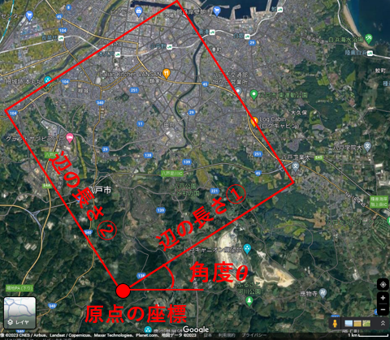

# 浸透・地表流解析，斜面安定解析のための標高データの作成

## 数値標高データのダウンロード

 - [国土地理院 基盤地図情報](https://fgd.gsi.go.jp/download/menu.php)より，数値標高モデルのファイル選択ページへ移動してダウンロード
 - [ダウンロード方法](https://fgd.gsi.go.jp/download/help/help_dem.pdf)
 - 5mメッシュと10mメッシュの2種類のデータがあるため両方ダウンロードしておく．(5mメッシュは都市域や河川周辺等の一部領域，10mメッシュは全国)

## ダウンロードしたデータの表示
 - 基盤地図情報ビューア上を用いてダウンロードした標高データを表示．   
　　[基盤地図情報ビューアのダウンロード](https://fgd.gsi.go.jp/download/documents.html)   
　　ダウンロードしたzipファイルを解凍し，FGDV.exeを実行．   
 - ダウンロードしたzipファイル(FG-GML-...)を基盤地図情報ビューアにドラッグアンドドロップすると，データが表示される．

## 座標データの作成
- 表示されている領域の標高データをx,y,zの座標として表現．
- 上のメニューの「エクスポート」→「標高メッシュをシェープファイルへ出力」
- 直交座標系に変換して出力に☑
- 系のところはそのまま(系について：[平面直角座標系](https://www.gsi.go.jp/sokuchikijun/jpc.html)を参照)
- 全データを出力を選択
- 出力先ファイルの右のマークを選択，ファイル名を設定．
- ファイルの形式については.xyzを選択して保存．
- この操作をデータ分繰り返す．

## fortranコードによる任意の領域の切り取り
- inputディレクトリに以下のファイルを入れる．

- **area3.txt**: 抽出する領域長方形領域   
　　1行目：矩形領域の各辺の長さ   
　　2行目：原点の座標
　　3行目：メッシュサイズ，原点と領域の1つの軸のなす角
  以下の図を参照

  ここでのxyは，東西方向がx，南北方向がyになるように指定．
  直交座標系では反対になっているので注意．

- **fname_ndata.txt**: 前で作ったxyzファイルとその中に含まれるデータ数をまとめたファイル   
  　1列目がファイル名，2列目にデータ数   
　　ファイル名にはパスを含む   
  　ファイル数分並べて書く   
  　topo_data.Rの前半を実行することで作成可能   

- topo_data.Rの前半部(Make fname_ndata.txt)の実行の流れ   
　　fnamesに読み込むファイル名を格納して実行する

- コンパイルして実行
- inputのディレクトリに作成された座標データが格納される→[浸透・地表流解析](https://github.com/K-Tozato/infiltration_sflow)や[斜面安定解析](https://github.com/K-Tozato/3D_slope_stability)の入力データとして使用可能

## 作成された座標データの確認
- topo_data.Rの後半部分を実行して，３次元の地図を出力して確認
- 標高値がない（データの範囲外）場合-9999の値が入る

## 付録（Rコードの"Convert coordinae"の部分）
- 緯度，経度のデータからxy直交座標系への変換
- 関数内のphi.oとlmd.oについては，直交座標の系[平面直角座標系](https://www.gsi.go.jp/sokuchikijun/jpc.html) に合わせて変更する．

